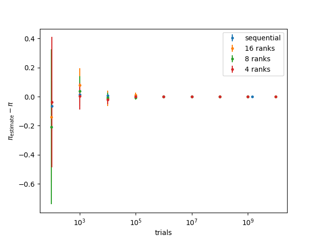
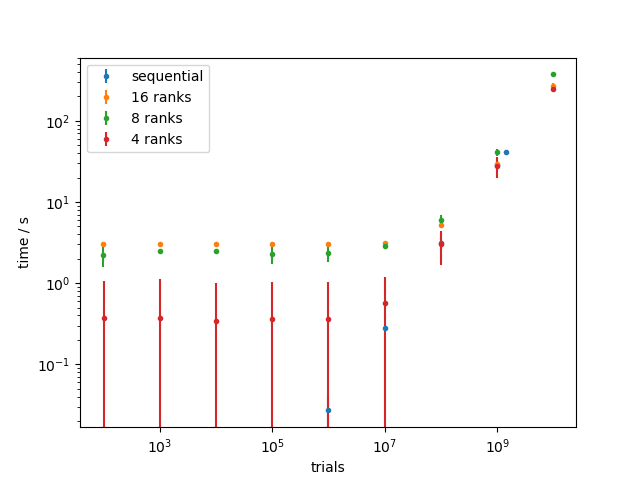

# Solution: Assignment 1

## Tasks 1
Write a sequential application `pi_seq` in C or C++ that computes π for a given number of samples (command line argument). Test your application for various, large sample sizes to verify the correctness of your implementation.

Implemented in pi_seq.c
Using Pythagorean theorem to check if a random point is inside or outside.
See graph below for verification.

## Task 2
Consider a parallelization strategy using MPI. Which communication pattern(s) would you choose and why?

Every node makes a few of the desired shots and counts if they are in- or outside the circle.
The counts are then accumulated in the end and rank 0 calculates pi from the counts

## Task 3
Implement your chosen parallelization strategy as a second application `pi_mpi`. Run it with varying numbers of ranks and sample sizes and verify its correctness by comparing the output to `pi_seq`.

Implemented in pi_mpi.c
Verification (Data points are mean & std. dev. of 10 runs. Sample size corresponds to trials.):

## Task 4
Discuss the effects and implications of your parallelization.

- Rounding number of desired samples to be divisible by number of ranks.
- Overhead for small sample sizes. (Lower overhead for less ranks.)
- Similar behavior to sequential code for large sizes.
- No measured speed-up. Larger samples might show speed-up. Tests with larger samples required for definitive answer.
- If no speed-up can be measured, another parallelization strategy must be chosen.

Time consumption (Data points are mean & std. dev. of 10 runs. Sample size corresponds to trials. Missing data points are below milliseconds.):

